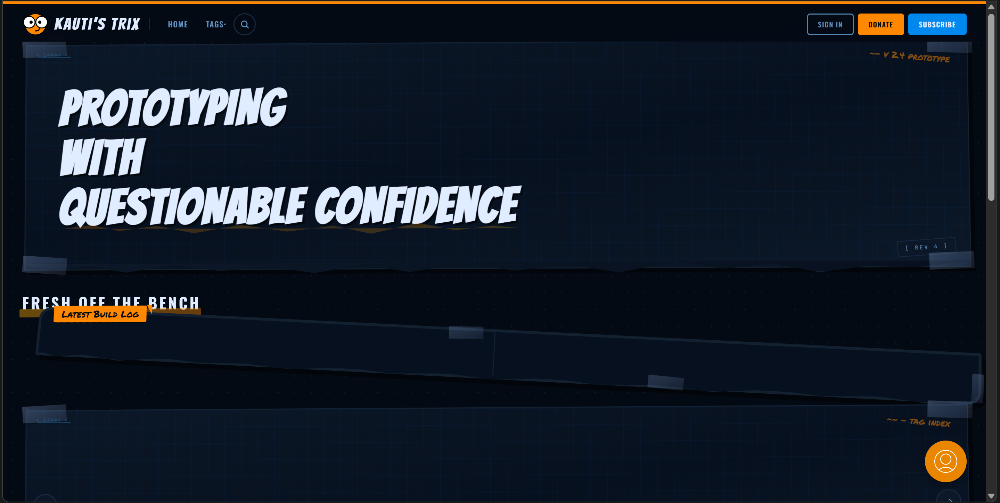
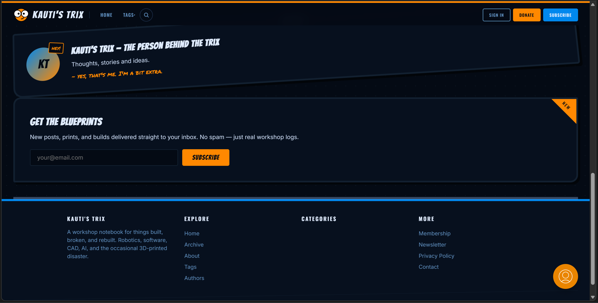

# 🛠️ Kauti's Trix

> A Ghost theme that looks like my workbench after a weekend of bad decisions.

**Workshop garage maximalist** — crooked, taped, blueprinted, unapologetic. If you want clean and minimal, you're in the wrong workshop.

---

## What's this?

A Ghost 6.0 blog theme for people who build things and don't care if it's pretty as long as it works (and sometimes even when it doesn't).

Built for my own blog — robotics, software, CAD, 3D printing, AI/ML, and the occasional build that caught fire. Everything is slightly tilted, held together with duct tape, and covered in marker annotations.

---

## Screenshots

| Home | Article |
|------|---------|
|  |  |

---

## Design

Full design spec is in [`design/DESIGN.md`](design/DESIGN.md) with the original HTML prototype at [`design/index.html`](design/index.html).

Quick version:
- **Colors**: Near-black navy (`#040a14`), electric blue (`#0088ee`), industrial orange (`#ff8800`)
- **Fonts**: Bangers (headlines), Oswald (titles), Inter (body), JetBrains Mono (code), Permanent Marker (scribbles)
- **Vibe**: Pegboard walls, duct tape, sticky notes, blueprint grids, screw-head bullets, terminal windows, and things held together with hope

---

## What's in the box

```
kautis-trix-ghost-theme/
├── default.hbs              # Shell
├── index.hbs                # Home page
├── post.hbs                 # Article page
├── page.hbs                 # About page
├── tag.hbs                  # Archive
├── author.hbs               # Author page
├── error-404.hbs            # 404
├── partials/
│   ├── header.hbs           # Nav bar (sticky, taped active states)
│   ├── hero.hbs             # Blueprint hero
│   ├── tag-carousel.hbs     # Tag slider from your Ghost tags
│   ├── manga-panel.hbs      # Latest build log callout
│   ├── post-card.hbs        # Crooked post cards
│   ├── newsletter.hbs       # Subscribe form
│   ├── toc-sidebar.hbs      # Sticky table of contents
│   ├── author-card.hbs      # Author bio
│   ├── related-posts.hbs    # Related articles
│   └── footer.hbs           # Footer
└── assets/
    ├── css/theme.css        # All the styles
    ├── js/theme.js          # Search, TOC, carousel, filter
    └── fonts/               # 13 woff2 files, zero CDN
```

---

## How to install

1. Download the ZIP from [Releases](https://github.com/1412kauti/trix-theme/releases)
2. Ghost Admin → Settings → Design → Upload theme
3. Pick the ZIP
4. Activate

Or clone and build yourself:
```bash
git clone https://github.com/1412kauti/trix-theme.git
cd trix-theme
zip -r ../trix-theme.zip . -x "*.git*" "scripts/*" "*.zip"
```

---

## Configuring it

Most stuff pulls from your Ghost settings automatically:

| What | Where in Ghost Admin |
|------|---------------------|
| Site title | Settings → General |
| Site description | Settings → General |
| Logo | Settings → Brand → Publication logo |
| Navigation | Settings → Navigation |
| Twitter/X link | Settings → Social Accounts |
| Facebook link | Settings → Social Accounts |
| Website link | Staff → Your Profile → Website |
| Tags | Tags page — they show up in the carousel, header dropdown, footer, hero |

---

## The tag carousel

On the home page, below "Fresh off the bench", there's a carousel that pulls all your tags from Ghost. Each card shows the tag name, description, and post count. Auto-rotates every 5 seconds, pauses when you hover or touch it. 3 slides on desktop, 1 on mobile.

---

## What's hardcoded (and why)

Some stuff you edit directly in the templates because it's design, not content:

- **Hero headline** → `partials/hero.hbs` (currently *"PROTOTYPING WITH QUESTIONABLE CONFIDENCE"*)
- **About page cards** → `page.hbs` (the What I Do grid, skill bars, current builds)
- **Footer stamp** → `partials/footer.hbs` (*"Made in a workshop / Sparks & mistakes / Rewired with coffee and duct tape"*)
- **Donate button** → `partials/header.hbs` (links to `#` by default — set your own URL)

---

## The cursor

Orange Bibata-style arrow. If you hate it, delete the `cursor: url(...)` line in `assets/css/theme.css`.

---

## Ghost 6.0 validation

Passes `gscan`. No errors.

---

## Browser support

Chrome/Edge 90+, Firefox 90+, Safari 15+, Ghost 6.0+.

---

## License

MIT. Go nuts.

---

<p align="center">
  <sub>Made in a workshop · Sparks & mistakes · Rewired with coffee and duct tape</sub>
</p>
